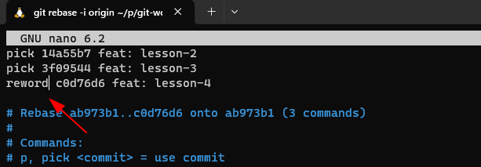
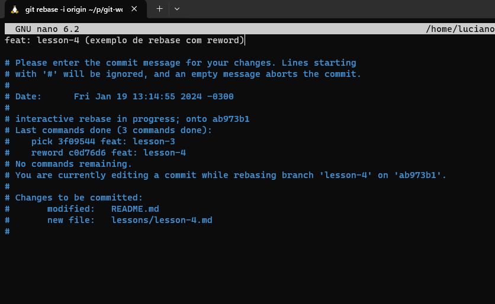

# Aula 4 (rebase, merge)

Nessa aula iremos aprender um pouco mais sobre comandos de manipulação de branches, que são os comandos que nos permitem manipular o histórico do repositório.

Pra entendimento básico sobre esses comandos, precisamos entender primeiro como o git armazena as alterações. O git armazena as alterações como um grafo direcionado acíclico, ou seja, um grafo que não possui ciclos e que possui direção, isso significa que cada commit possui um ponteiro para o commit anterior.

Dado o cenário de trabalho em paralelo, é comum que as branches que utilizamos fiquem desatualizadas. isso acontece porque o git não atualiza as branches automaticamente. Para atualizar uma branch, precisamos usar o comando `git merge` ou `git rebase`.

Esse artigo descreve bem a diferença entre os dois comandos: https://medium.com/@lovepreet013singhhundal/git-merge-vs-git-rebase-d386e1f3cda7

De forma geral, pra visualizar a diferença entre eles, podemos usar o seguinte exemplo:


No caso do comando `git merge develop`, copiamos com um novo commit as mudança que aconteceram na branch develop, para a branch corrente (no caso feature/login). 
No caso comando `git rebase develop`, ajustamos o histórico da linha branch e atualizamos a referência de onde a branch corrente se inicia. 

**No fim desse arquivo teremos um exercício prático antes de seguir para a próxima aula.**

## Rebase

O comando git rebase é usado para atualizar o histórico de uma branch, ele é usado para atualizar o histórico de uma branch com base em outra branch.

A sua forma mais comum é `git rebase <branch>`, onde o git irá utilizar o histórico da branch corrente e aplicar as mudanças da branch passada como parâmetro.

O comando rebase também tem algumas variações. A que considero mais importante, seria a `git rebase --interactive <branch>` (ou `git rebase -i <branch>`). Que nos permite manipular o histórico de uma branch de forma interativa, onde podemos escolher quais commits queremos manter, quais queremos editar e quais queremos remover.

Usar o rebase interativo nos permite manipular commits do passado, editar ordem de commits, alterar a mensagem de commits, agrupar diversos commits em um só e até mesmo remover commits.

Exemplo:






[Guia que pode ser útil pra quem quiser se aprofundar no uso de rebase interativo](https://medium.com/@lukz/git-rebase-interactive-e-amend-para-uma-melhor-hist%C3%B3ria-no-seu-projeto-cb2f5c09b161)

## Merge

O comando git merge é utilizado para atualizar o histórico de uma branch, usando como base outra branch.
O uso dele é bem simples, basta usar o comando `git merge <branch>` e o git irá criar um novo commit com as mudanças da branch passada como parâmetro.
Apesar de mais simples que o rebase, o merge pode gerar um histórico de commits mais poluído. Isso acontece, pois ele cria um novo commit com as mudanças da branch passada como parâmetro, mais conhecido como `merge commit`.  Por isso para gestão de branches ,eu aconselho o uso do rebase ao invés do merge.

# Prática 4

Obs: é necessário a conclusão da prática 3 para a realização dessa prática.

Na aula passada, tivemos que fazer uma correção no arquivo `lessons/lesson-3.md`. Entretanto, essa branch `lesson-4` em que estamos foi, originada da branch `lesson-3` antes da correção. Portanto, não possui o commit de correção que fizemos. Para realizar a correção,  iremos  atualizar a branch `lesson-4` com as mudanças da branch `lesson-3`, usando o comando `git rebase`.

Para isso, precisamos fazer o seguinte:
1. Vamos executar inicialmente o comando `git log --oneline`, pra visualizar o estado atual do nosso histórico de commits.
Fora as hashes diferentes deve estar proximo a esse modelo:
```text
(HEAD -> lesson-4) feat: lesson-4
(lesson-3) feat: lesson-3
(origin/lesson-2, lesson-2) feat: lesson-2
(origin/main, origin/HEAD, main) feat: lesson-1
Initial commit
```
2. Pra conseguir atualizar a referencia da branch `lesson-3`, precisamos executar o comando `git rebase lesson-3` ou `git rebase origin/lesson-3`.
3. Agora podemos executar novamente `git log --oneline` e conferir se agora o commit `feat: fix lesson-3 typo` aparece na `branch lesson-3`, antes da `branch lesson-4`.
4. Para explorar o rebase interativo, podemos também executar o comando `git rebase -i lesson-3` e fazer o reword do commit `feat: lesson-4` para `feat: lesson-4 (rebase, merge)`. (usar como referencia o exemplo do rebase interativo acima)
5. Agora que ajustamos as nossas referencias, podemos fazer o `git push origin lesson-4` para enviar as mudanças para o repositório remoto.

--- 

Podemos seguir para a próxima aula na branch `lesson-5`.